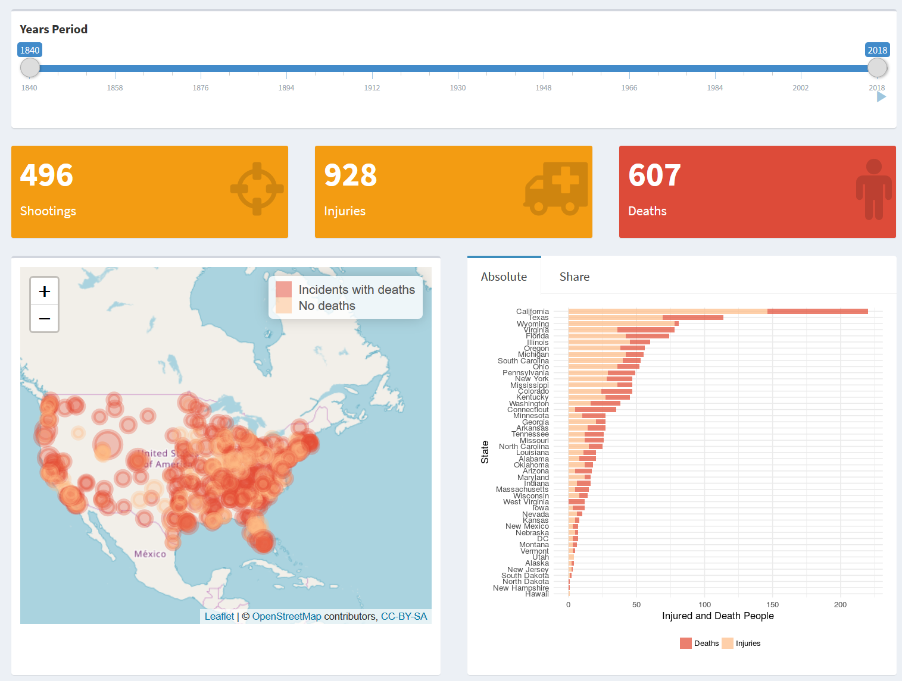

# About
This project was built for a blog post which you can find here:   

[https://somtom.github.io/post/usa-school-shootings/](https://somtom.github.io/post/usa-school-shootings/)

## Source

The dataset originates from the Wikipedia article [List of school shootings in the United States](https://en.wikipedia.org/wiki/List_of_school_shootings_in_the_United_States) .

You can find the source code for the shiny application in this repository.

A blogpost about the data import and processing can be found [here](https://somtom.github.io/post/usa-school-shootings/) .

## What is this App for?

This app was built to provide a opportunity to explore the United States school shootings data present in the Wikipedia article's list. You are supposed to get a feeling for the documented indices by exploring what happened when and where. The dataset does not raise the claim to be complete and to include every incidents ever happened. Therefore it may not be appropriate to use the data for statistical inference.

To keep the dashboard's data up-to-date I plan to update the data manually from time to time. 
